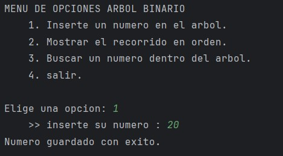
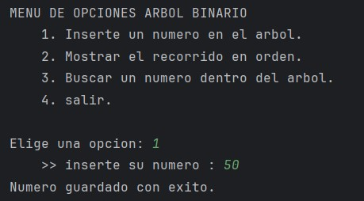
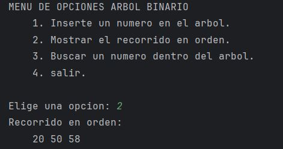
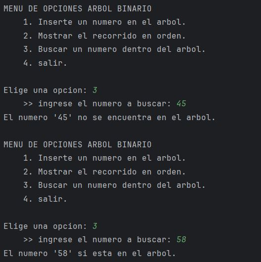
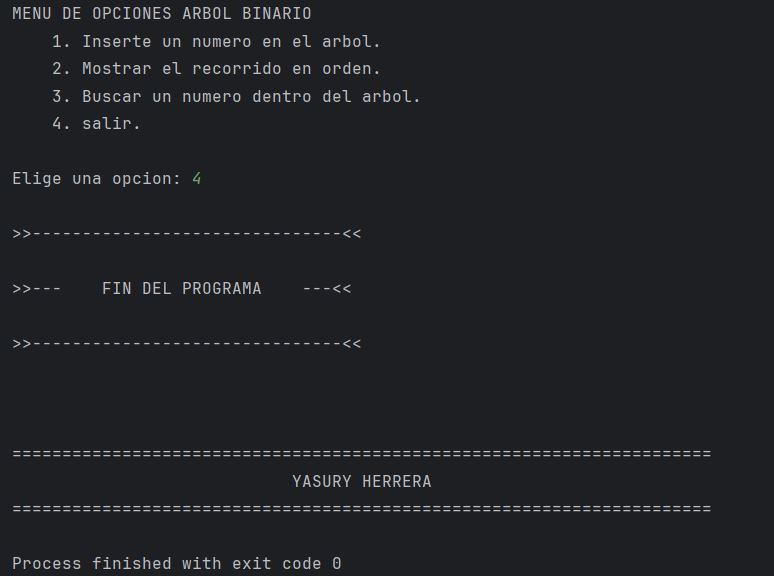

# Arboles Binario Simple.
Trabajo de manejo de arboles 

### Definición de árbol binario.
Un árbol binario es una estructura de datos jerárquica compuesta por nodos, donde cada nodo puede tener como máximo dos hijos:

* Izquierdo → contiene valores menores al nodo actual.
* Derecho → contiene valores mayores al nodo actual.

El primer nodo se llama raíz.
Se utiliza mucho en búsquedas rápidas, ordenamiento y representación de estructuras jerárquicas.

# Cómo está implementado el código.
El programa está dividido en varias partes:

### 1. Clase Node

Define la estructura básica de un nodo:
* int key → valor almacenado en el nodo.
* Node left, right → referencias a los hijos izquierdo y derecho.
* Constructor que recibe el valor (item) y crea un nodo nuevo.

### 2. Clase Tree

Administra el árbol binario con los siguientes métodos:
* insert(int key) → inserta un nuevo valor.
* insertRec(Node root, int key) → inserción recursiva, decide si va a la izquierda o derecha.
* search(int key) → busca un valor en el árbol.
* searchRec(Node root, int key) → búsqueda recursiva (devuelve true o false).
* inorder() → recorrido inorden.
* inorderRec(Node root) → recorre primero el hijo izquierdo, luego la raíz y después el derecho (mostrando los valores en orden ascendente).

### 3. Clase Main

Contiene la lógica del programa y el menú interactivo:

* Se usa un Scanner para capturar datos por consola.
* Se utiliza una expresión regular (^\\d+$) para validar que el usuario ingrese solo números enteros.
* Se construye un menú con opciones mediante do...while y switch:
* Insertar un número en el árbol.
* Mostrar recorrido en orden.
* Buscar un número en el árbol.
* Salir del programa.
* Se usa Thread.sleep(2000) para pausar 2 segundos antes de volver a mostrar el menú.

# Ejecución en consola.
### OPCIÓN 1 

### OPCIÓN 2

### OPCIÓN 3

### OPCION 4

# Contribuyentes: 
| Usuario                                              | Rol                                |
|------------------------------------------------------|------------------------------------|
| [@Yasurigalaraga](https://github.com/Yasurigalaraga) | Documentacion, Desarrollo y Diseño |

